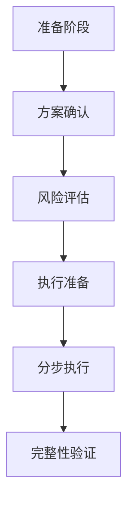

# 批量操作流程指南

## 操作流程概览

### 标准操作流程


## 1. 准备阶段

### 1.1 创建批次
```json
{
    "batch_id": "BATCH_[日期]_[序号]",
    "operation_type": "[操作类型]",
    "created_by": "[操作者]",
    "created_at": "[时间戳]"
}
```

### 1.2 初始化目录
```
.batch_operations/
└── [batch_id]/
    ├── status/
    ├── backup/
    └── logs/
```

## 2. 方案确认阶段

### 2.1 方案文档（temp/[batch_id]_plan.md）
```markdown
# 操作方案
## 修改范围
- 影响文件：[文件列表]
- 影响卡牌：[卡牌列表]

## 具体修改
- [详细的修改内容]

## 预期结果
- [预期的效果]
```

### 2.2 确认清单
- [ ] 修改范围合理性确认
- [ ] 具体数值合规性确认
- [ ] 影响范围评估确认
- [ ] 操作步骤完整性确认

## 3. 风险评估阶段

### 3.1 风险评估表（temp/[batch_id]_risk.md）
```markdown
# 风险评估
## 潜在风险
1. [风险点1]
2. [风险点2]

## 应对措施
1. [措施1]
2. [措施2]

## 回滚计划
- [详细的回滚步骤]
```

### 3.2 评估确认项
- [ ] 数值范围检查
- [ ] 组合效果分析
- [ ] 极限情况测试
- [ ] 回滚方案确认

## 4. 执行准备阶段

### 4.1 准备清单
```markdown
# 执行准备
## 备份确认
- [ ] 创建完整备份
- [ ] 验证备份完整性

## 工具准备
- [ ] 检查必要工具
- [ ] 验证工具可用性

## 环境确认
- [ ] 检查系统状态
- [ ] 确认执行权限
```

### 4.2 执行计划
```markdown
# 执行计划
## 步骤顺序
1. [步骤1]
2. [步骤2]

## 检查点
- 步骤1后：[检查内容]
- 步骤2后：[检查内容]
```

## 5. 分步执行阶段

### 5.1 执行记录模板
```markdown
# 执行记录
## 步骤 [N]
- 开始时间：[时间戳]
- 执行内容：[具体操作]
- 执行结果：[结果状态]
- 检查结果：[验证信息]
```

### 5.2 步骤确认表
- [ ] 执行前状态确认
- [ ] 执行过程记录
- [ ] 执行后验证
- [ ] 检查点备份创建

## 6. 完整性验证阶段

### 6.1 验证清单
```markdown
# 完整性验证
## 数据验证
- [ ] 文件完整性检查
- [ ] 数值正确性验证
- [ ] 格式规范检查

## 功能验证
- [ ] 基本功能测试
- [ ] 组合效果测试
- [ ] 极限情况测试
```

### 6.2 最终确认
- [ ] 所有修改已完成
- [ ] 所有检查点已通过
- [ ] 所有日志已记录
- [ ] 临时文件已清理

## 异常处理流程

### 1. 执行异常
```markdown
# 异常处理
## 异常情况
- 类型：[异常类型]
- 描述：[具体描述]

## 处理步骤
1. [处理步骤1]
2. [处理步骤2]

## 预防措施
- [预防措施1]
- [预防措施2]
```

### 2. 回滚流程
```markdown
# 回滚操作
## 触发条件
- [具体条件]

## 回滚步骤
1. [步骤1]
2. [步骤2]

## 确认项
- [ ] 回滚完成确认
- [ ] 系统状态确认
```

## 操作示例

### 示例1：单个数值调整
```markdown
# 操作：调整攻击牌伤害值
## 步骤1：准备
- 创建批次：BATCH_20240205_001
- 初始化工作目录
- 创建完整备份

## 步骤2：执行
- 修改数值
- 创建检查点
- 验证修改

## 步骤3：确认
- 检查修改结果
- 验证功能正常
- 清理临时文件
```

### 示例2：批量属性调整
```markdown
# 操作：全局伤害值调整
## 准备阶段
- 创建修改方案
- 评估影响范围
- 创建备份点

## 执行阶段
- 分批次修改
- 创建检查点
- 验证每批次结果

## 完成阶段
- 全量验证
- 功能测试
- 确认完成
``` 